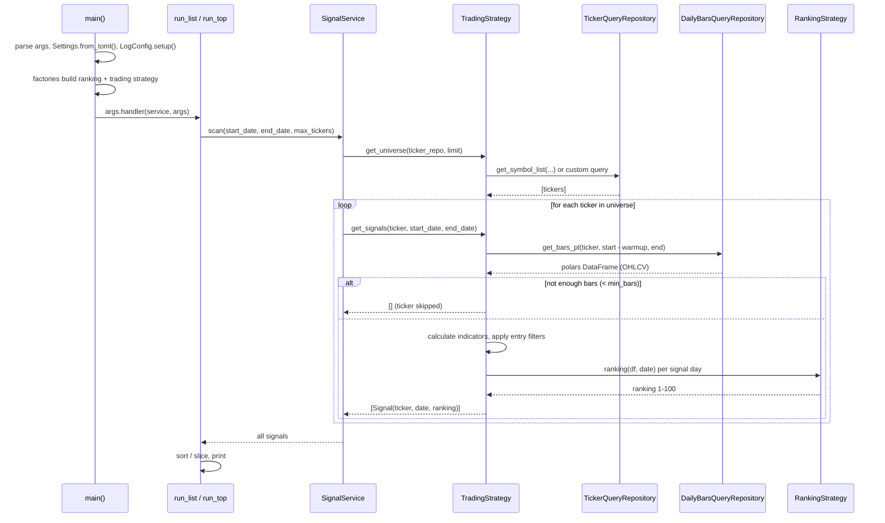

# signal-runner Architecture

How the `signal-runner` CLI turns a command line into printed trading signals. Companion to [scripts.md](scripts.md) (usage reference) and [service.md](service.md) (service layer).

## Entry points

There are two equivalent ways to invoke the runner; both end up in the same `main()`:

- `uv run signal-runner ...` — console script installed via `[project.scripts]` in `pyproject.toml`, pointing at `turtlex.cli.signal_runner:main`
- `uv run python scripts/signal_runner.py ...` — thin compatibility wrapper that imports the same `main()`

## Component composition

`main()` is the composition root: it builds the object graph once per run and injects dependencies through constructors (no globals). Each subcommand is a small handler function selected by argparse (`set_defaults(handler=...)`).

Key design points:

- **Command pattern** — one handler per subcommand (`run_list`, `run_top`, `run_signal`), all with the signature `(service, args) -> int`; argparse enforces per-command arguments.
- **Strategy pattern** — the CLI depends only on the `TradingStrategy` / `RankingStrategy` ABCs; concrete classes are chosen by name via the factories in `turtlex/strategy/factory.py`.
- **Repository pattern** — all SQL lives in `turtlex/repository/`; strategies receive repositories, never the engine.

## Subcommands

| Command | Handler | Scope | Extra options |
| --------- | --------- | ------- | --------------- |
| `list` | `run_list` | whole universe, sorted by (date, ticker) | `--max-tickers` |
| `top` | `run_top` | whole universe, top N by ranking | `--max-tickers`, `--limit` (default 20) |
| `signal` | `run_signal` | explicit tickers (positional args) | — |

`list` and `top` share one `SignalService.scan()` call and differ only in how they sort and slice the result. `signal` skips the universe entirely and calls the trading strategy directly per ticker.

## Signal generation flow (`list` / `top`)

Notes on the flow:

- **Warmup** — each strategy fetches `warmup_period` days of history before `start_date` (e.g. 730 days for qullamaggie) so indicators like SMA200 or 252-day ROC are warm on day one. Tickers with fewer than `min_bars` rows are silently skipped (logged at DEBUG).
- **Universe ownership** — the strategy, not the CLI, decides its universe. The default (`TradingStrategy.get_universe`) reads the `active` symbol group; `QullamaggieStrategy` overrides it with a fundamentals query (`get_qullamaggie_qualified_symbols`: US common stocks, market cap ≥ 1.5B, sector exclusions).
- **Ranking** — every emitted `Signal` carries a 1-100 ranking computed by the injected `RankingStrategy`; `top` sorts on it.

## Signal flow (`signal` command)

The `signal` command bypasses `SignalService.scan()` and the universe: for each ticker given on the command line it calls `trading_strategy.get_signals(ticker, start_date, end_date)` directly — the same per-ticker path as inside the scan loop above.

## Where things live

| Concern | File |
| --------- | ------ |
| CLI parsing, handlers, wiring | `turtlex/cli/signal_runner.py` |
| Universe scan orchestration | `turtlex/service/signal_service.py` |
| Strategy base (universe, warmup, data gate) | `turtlex/strategy/trading/base.py` |
| Concrete trading strategies | `turtlex/strategy/trading/*.py` |
| Ranking strategies | `turtlex/strategy/ranking/*.py` |
| Name → class factories | `turtlex/strategy/factory.py` |
| OHLCV / universe repositories | `turtlex/repository/query/daily_bars.py`, `turtlex/repository/query/ticker.py` |
| Compatibility wrapper | `scripts/signal_runner.py` |
