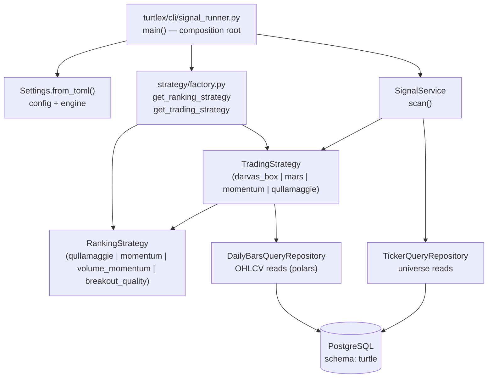
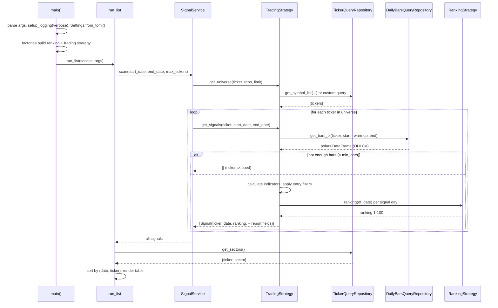

# signal-runner Architecture

How the `signal-runner` CLI turns a command line into printed trading signals. Companion to [scripts.md](scripts.md) (usage reference) and [service.md](service.md) (service layer).

## Entry points

The runner is invoked as `uv run signal-runner ...` — a console script installed via `[project.scripts]` in `pyproject.toml`, pointing at `turtlex.cli.signal_runner:main`.

## Component composition

`main()` is the composition root: it builds the object graph once per run and injects dependencies through constructors (no globals), then calls `run_list(service, args)` directly.

Key design points:

- **Strategy pattern** — the CLI depends only on the `TradingStrategy` / `RankingStrategy` ABCs; concrete classes are chosen by name via the factories in `turtlex/strategy/factory.py`.
- **Repository pattern** — all SQL lives in `turtlex/repository/`; strategies receive repositories, never the engine.

## Signal generation flow

Notes on the flow:

- **Warmup** — each strategy fetches `warmup_period` days of history before `start_date` (e.g. 730 days for qullamaggie) so indicators like SMA200 or 252-day ROC are warm on day one. Tickers with fewer than `min_bars` rows are silently skipped (logged at DEBUG).
- **Universe ownership** — the strategy, not the CLI, decides its universe. The default (`TradingStrategy.get_universe`) reads the `active` symbol group; `QullamaggieStrategy` overrides it with a fundamentals query (`get_qullamaggie_qualified_symbols`: US common stocks, market cap ≥ 1.5B, sector exclusions).
- **Ranking** — every emitted `Signal` carries a 0-100 ranking computed by the injected `RankingStrategy`.
- **Report fields** — `QullamaggieStrategy` additionally fills each `Signal` with the signal-date indicator values, the signal-date raw close, and the last bar of the window, which is what `run_list` renders as columns. The other strategies leave those empty and their cells render `--`.
- **`--max-tickers`** — caps how many universe tickers `get_universe` returns (default 10000); harmless if the strategy's universe is smaller.

## Where things live

| Concern | File |
| --------- | ------ |
| CLI parsing, wiring | `turtlex/cli/signal_runner.py` |
| Universe scan orchestration | `turtlex/service/signal_service.py` |
| Strategy base (universe, warmup, data gate) | `turtlex/strategy/trading/base.py` |
| Concrete trading strategies | `turtlex/strategy/trading/*.py` |
| Ranking strategies | `turtlex/strategy/ranking/*.py` |
| Name → class factories | `turtlex/strategy/factory.py` |
| OHLCV / universe repositories | `turtlex/repository/query/daily_bars.py`, `turtlex/repository/query/ticker.py` |
